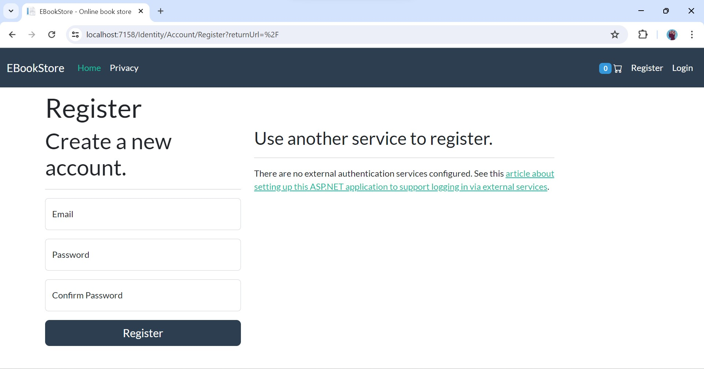
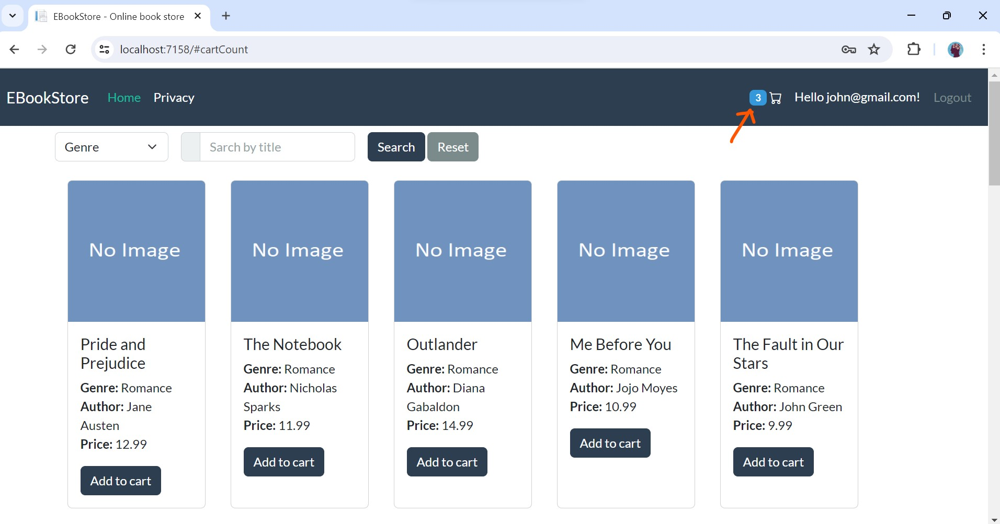
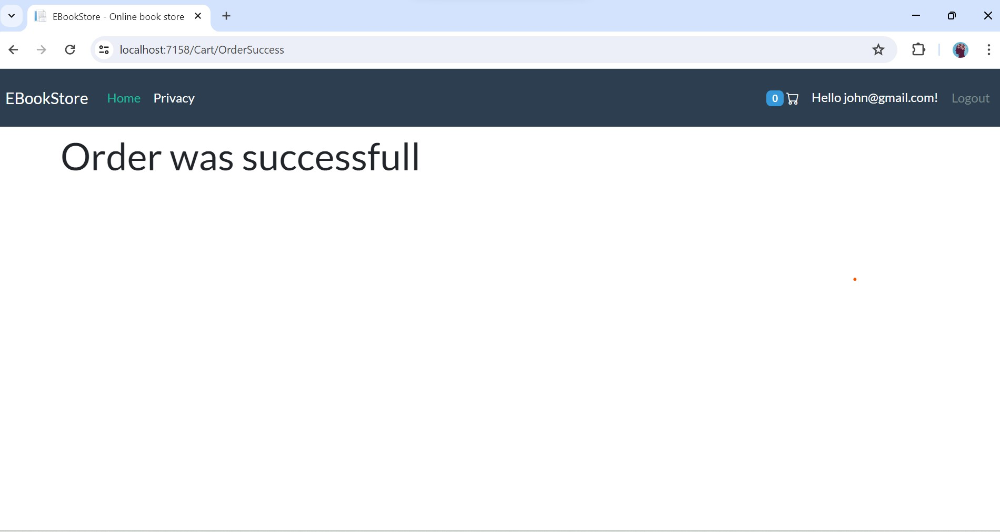
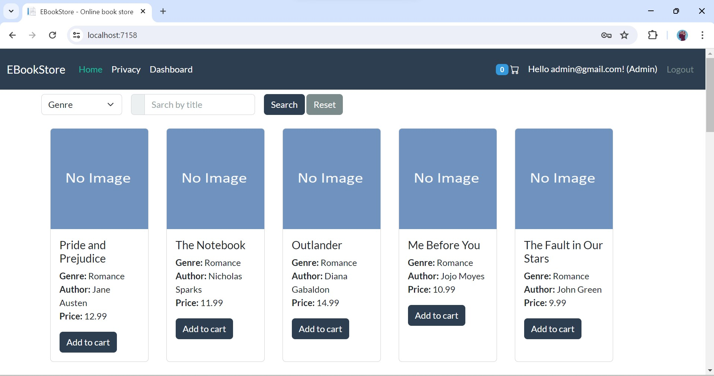

# BookShoppingCartMvc

BookShoppingCartMvc is a simple e-commerce application built with **ASP.NET Core MVC**. It was created to help beginners understand how an online shopping cart works and has been expanded into a basic online bookstore.

The application allows users to browse books, add them to a shopping cart, place orders, and view their order history. It also includes an admin panel to manage books, genres, stock, and customer orders.

This project is intended for learning and practicing ASP.NET Core MVC concepts. It does not include an online payment gateway and currently supports **Cash on Delivery (COD)** only.

If you find this project useful, consider giving it a **Star** on GitHub.
```

## Tech stack 

   - Dotnet core mvc (.Net 9)
   - MS SQLServer 2022 (Database)
   - Entity Framework Core (ORM)
   - Identity Core (Authentication)
   - Bootstrap 5 (frontend)

## Tools I have used and their alternative

- Visual Studio 2022 (Alternatives (.NET SDK + VS Code or .NET SDK + JetBrains Rider)
- Microsoft Sql Server Management Studio (Alternative Azure data studio or you can just execute sql from terminal)


## How to run the project?

1. Open the command prompt. Go to a directory where you want to clone this project. Use this command to clone the project.

```bash
git clone https://github.com/rd003/BookShoppingCart-Mvc
```

2. Go to the directory where you have cloned this project, open the directory `BookShoppingCart-Mvc`. You will find a file with name `BookShoppingCartMvc.sln`. Double click on this file and this project will be opened in Visual Studio.

3. Open `appsettings.json` file and update connection string.

```json
"ConnectionStrings": {
  "conn": "data source=your_server_name;initial catalog=MovieStoreMvc; integrated security=true;encrypt=false"
}
```

4. Run the project.

 When you run the project for the first time, it will do following things:

- It will generate the database
- It will seed some data
- It will create an account for `admin`

## How to logged-in with admin account?? 

Click on the link named `login` and get logged-in with these credentials.

```text
username: admin@gmail.com

password: Admin@123
```

## Screenshots

1.Homepage


2.Homepage continued


3.Login


4.Registration



5.Add To Cart



6.Cart


7.Checkout


8.Order success



9.Admin Login



10.Admin Dashboard


11.Orders


12.Order Detail


13.Update Order Status


14.Display Stock


15.Update Stock


16.Display Genre


17.Add Genre


18.Update Genre


19.Display Books


20.Add Book


21.Update Book


22.Top Selling Books


## Thanks
